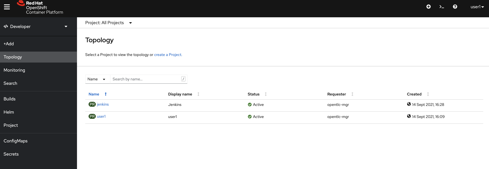
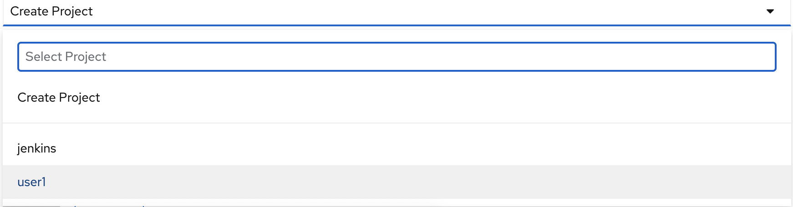
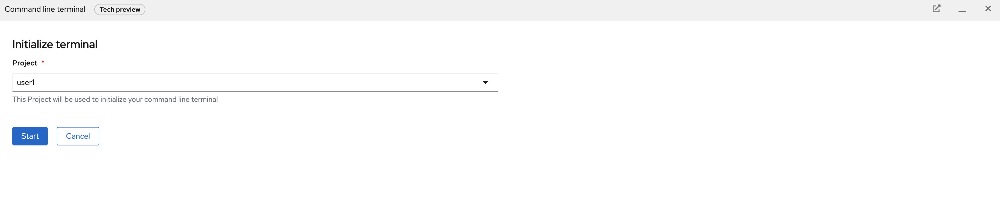

# Deploy your API into 3scale with Jenkins

Welcome to the challenge,

I hope you enjoy it. In this challenge you will need to create an OpenAPI Spec, After it you will need to create a RESTful API(Choose your desired language), Deploy it in your namespace(userX). Then, using the 3Scale toolbox(Add 3scale-toolbox secret), deploy the API by creating a BuildConfig of type Pipeline. Your namespace already has a Jenkins instance configured to fire the Pipeline build.

## Introduction

### Products and Projects

* [Red Hat OpenShift Container Platform](https://www.redhat.com/en/technologies/cloud-computing/openshift)
* [Red Hat 3scale API Management](https://www.redhat.com/en/technologies/jboss-middleware/3scale)
* [Red Hat Single Sign On](https://access.redhat.com/products/red-hat-single-sign-on)
* [Apicurio](https://www.apicur.io/)
* [3scale-toolbox](https://github.com/3scale/3scale_toolbox/)
* [Jenkins](https://www.jenkins.io/)

### Pre-requisites

* Knowledge of the current version of the OpenAPI specification: [OpenAPI Specification 3.0.1](https://github.com/OAI/OpenAPI-Specification/blob/master/versions/3.0.1.md)
* Internet access with no blacklist filtering on:
  * *.open.redhat.com
* Able to install 3scale-toolbox locally **
* OC Cli (4.6) (Optional) **

** NOTE:
If you don't have rights to install OC Cli or 3scale-toolbox cli in your computer. We have provided a virtual terminal with the required tools to be able to accomplish the exercises.

To initialise and open it:

1. Click **>_** Icon located at top right corner.
   
2. Then select your user namespace.
   
3. Click **Create** button.
   
4. You will have the terminal ready with the 3scale command and oc cli already connected with your credentials.

### Slides

Check the latest [Slides](https://docs.google.com/presentation/d/1o-hT8gVyKrgQbIltY0lJil0oOXKLn07k00UddRMVOfE/edit?usp=sharing) for delivering this workshop.

### Support & Ownership

#### Challenge with 3scale 3.9 and CICD

Feel free to ask [Mikel Sanchez](mailto:misanche@redhat.com) if you need some support when there are any questions left or if you need some support.
